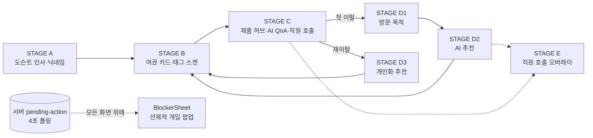

# TagOn AI · Frontend

> 명품 매장에 부착된 NFC 태그를 스캔하면 열리는, AI 기반 매장 컨시어지 서비스의 프론트엔드입니다.
> 고객은 직원 없이도 여권(Journey Card) UI로 상품을 탐색하고 AI에게 자유롭게 질문하며, 서버가 판단한 이탈 신호가 오면 화면 어디서든 개입 팝업이 자동으로 뜹니다.

[](#)
[](#)
[](#)
[](#)
[](#)

---

## 1. 프로젝트 개요

명품 매장 고객은 직원에게 말 걸기를 부담스러워하지만, 그렇다고 아무 안내 없이 혼자 두면 조용히 이탈합니다.

**TagOn AI 프론트엔드**는 상품 태그를 스캔하는 순간(STAGE B)부터 세션을 시작해, 백엔드가 제공하는 두 축을 화면으로 구현합니다.

- **셀프 탐색(STAGE C·D)**: 소재·헤리티지·사이즈·컬러 같은 상품 정보를 스스로 확인하고, AI에게 자유 질문을 던지고, 관심 상품을 여권 카드에 콜라주로 모읍니다.
- **선제적 개입(Blocker)**: 서버가 실시간으로 채점한 이탈 신호를 4초 간격 폴링으로 받아, 지금 보고 있는 화면 위에 바텀시트로 자동 노출합니다. 프론트엔드는 감지 로직을 갖지 않고 오직 표시만 담당합니다.

> 브랜치를 새로 받으면 `npm install`을 먼저 실행하세요. 의존성이 없으면 `tsc -b`가 실패합니다.

---

## 2. 핵심 기능

| 기능 | 설명 |
| --- | --- |
| **태그 스캔 → 상품 허브** | STAGE B에서 태그를 스캔하면 STAGE C 1차 허브(상품 이해/핏·취향/구매 조건/기타)로 이동. 하위 옵션은 스캔한 SKU 기준 값만 노출 |
| **여권(Journey) 카드** | STAGE B는 도슨트 대신 여권 카드 화면입니다. STAGE C·D 우상단 버튼으로 같은 카드를 탑시트로 다시 열 수 있고, 콜라주 4칸이 채워지면 완성 팝업과 도장 슬램 애니메이션이 세션당 1회 뜹니다 |
| **AI 자유질문 QnA (C5)** | 고객이 자유 텍스트로 질문하면 서버가 상품 컨텍스트 안에서만 답변. 가격·재고처럼 민감한 질문은 직원 상담으로 유도 |
| **AI 상품 추천 (D2·D3)** | 방문 목적·스캔 이력 기반 추천 3종을 카드로 노출. 첫 이탈은 D1 방문 목적 확인 뒤 추천, 두 번째 이탈부터는 목적 확인 없이 바로 추천 |
| **선제적 개입 팝업 (Blocker)** | `GET /session/pending-action`을 4초 간격 폴링해 CB1·CB3·CB5·CB6 트리거를 `BlockerSheet`로 표시. CB1은 고객에게 노출하지 않음 |
| **직원 호출 · 시착 요청 · 구매 문의 · 연락처 수집 · 방문 목적** | STAGE C·E 곳곳에서 매장 직원 연결이 필요한 순간을 세션 단위로 기록 |
| **3D 도슨트** | 11개 절차적 cue(인사·경청·안내·성공 등)와 reduced-motion·WebGL fallback을 지원하는 Three.js 캐릭터. 화면 의미에 따라 선별 노출 |
| **시연·디버그 도구** | 목업 셸 바깥의 `CB3 발동`·`CB6 발동`·`화면`·`API` 버튼(production 포함), 개발 빌드 전용 API 진단 패널(LIVE/MOCK 데이터 출처 표시) |

---

## 3. 화면 흐름



STAGE E와 여권 카드는 독립 페이지 전환 대신 현재 화면 위에 표시되는 오버레이입니다.

---

## 4. 선제적 개입(Blocker) 연동

프론트엔드는 트리거 감지 로직을 갖지 않습니다. 서버가 판단한 결과를 폴링해 표시만 합니다.

| 트리거 | 프론트 표시 방식 | 확인 상태 |
| --- | --- | --- |
| **CB1** | 표시하지 않음(서버 판단만 사용) | — |
| **CB3** | 직원 호출 5분 미응답 → `BlockerSheet` | ✅ 발동 확인 |
| **CB5** | 가격 확인 후 저가 이탈/무활동 → `BlockerSheet` | ⏳ 미확인 |
| **CB6** | 시착 요청 후 무응답/재방문 → `BlockerSheet` | ✅ 발동 확인 |

선택 결과는 `actionNextStep`에 따라 STAGE E 접수 오버레이 또는 D3 개인화 추천으로 이어집니다. 자세한 재검증 이력은 아래 [10. 알려진 제약](#10-알려진-제약)을 참고하세요.

---

## 5. 기술 스택

| 영역 | 사용 기술 |
| --- | --- |
| Language / Framework | React 19, TypeScript 6, Vite 8 |
| Routing | React Router 8 |
| Styling | Tailwind CSS 4, `tailwind-merge`, CSS custom properties 기반 디자인 토큰 |
| Motion / 3D | Framer Motion, GSAP, Three.js / React Three Fiber / Drei |
| API 클라이언트 | Axios |
| 이미지 캡처 | `html2canvas-pro` (여권 카드 이미지 저장) |
| 정적 분석 | Oxlint |
| 배포 | PWA 매니페스트 + 서비스워커(production 빌드 한정), Vercel |

---

## 6. 백엔드 연동 현황

기준: 2026-08-19 (`41-add-api-연결` 작업 트리 기준, 이후 API 17~25 반영)

| 영역 | 상태 | 비고 |
| --- | --- | --- |
| 세션·닉네임·태그 스캔·허브 인터랙션 | LIVE | `api.tagonai.site` |
| 방문 목적·AI 추천·직원 호출·착장 요청·구매 문의 | LIVE | 순수 Mock으로만 끝나는 고객 기능은 없음 |
| C5 AI 답변·연락처·Blocker 팝업·세션 종료 | LIVE | |
| C4-1 가격 요청 | LIVE(우회) | 전용 엔드포인트 대신 `staff-calls`로 기록 |
| 제품 콘텐츠 | 하이브리드 | 제품명·컬러·로드 가능한 이미지는 서버 우선, 이미지 실패·사이즈·치수·소재/헤리티지/스타일링 상세는 fixture로 보완 |
| STAGE E 직원 호출 | LIVE | 전용 엔드포인트 없이 STAGE C와 같은 `staff-calls`를 `reason`으로 구분. 실시간 SA 응대 상태 동기화 없음 |

화면별 데이터 출처는 로컬 `docs/SCREEN_DATA_MAP.md`에 전수 정리돼 있습니다.

`localStorage`에 `sessionId`와 서버 제품 문맥(`productId`·`currentSkuId`·`currentSku`)을 저장해 새로고침·앱 전환 뒤에도 서버 기록이 이어집니다. **세션 이벤트 타임라인과 Intent Score는 메모리 전용**이라 초기화됩니다.

서버 호출이 실패해 대체 데이터로 진행 중이면 화면 상단에 안내 배너가 뜹니다.

---

## 7. 주요 화면 경로

| 경로 | 설명 |
| --- | --- |
| `/stage-a/intro` | 도슨트 소개 |
| `/stage-a/nickname` | 닉네임 설정 |
| `/stage-b/nfc` | 여권 카드 · NFC 태그 안내 |
| `/stage-b/recognizing?sku=...&tagId=...` | 태그 인식 후 STAGE C 이동 |
| `/stage-c/:sku` | 제품 소개 · 1차 허브 |
| `/stage-c/:sku/product` | 제품 이해 허브 (`/craft`, `/heritage`, `/styling`) |
| `/stage-c/:sku/fit` | 핏·착장 허브 (`/size`, `/color`, `/try-on`) |
| `/stage-c/:sku/purchase` | 가격 안내 요청 기록 → C4-1 완료 화면으로 리다이렉트 |
| `/stage-c/:sku/other` | 기타 질문 (`/answer`, `/staff-call/*`) |
| `/stage-c/:sku/coming-soon/STAGE-D1` | 첫 제품 이탈 뒤 방문 목적 선택으로 연결되는 호환 경로 |
| `/stage-d/recommend` | D2 목적 기반 추천 |
| `/stage-d/location-guide` | D2-1 위치 안내 |
| `/stage-d/personalized-recommend` | D3 개인화 추천 (두 번째 이탈부터) |
| `/stage-d/personalized-location-guide` | D4 위치 안내 |
| `/session-end` | 세션 종료 안내 (앱 내 진입 경로 없음 — [10. 알려진 제약](#10-알려진-제약) 참고) |
| `/demo` | 시연용 iPhone 목업 셸 |
| `/__dev/stage-f` | STAGE F 시각 QA 패널 (development build 전용) |

> 구 F3~F8 체계의 `/stage-f/*` 7개 경로와 `?demo=` 진입은 2026-08-18에 제거했습니다.

---

## 8. 프로젝트 구조

```
src/
├── pages/              # 화면 단위 (StageA~F, Demo, SessionEndPage)
│   ├── StageA/          # 도슨트 인사 · 닉네임
│   ├── StageB/          # 여권 카드 · 태그 인식
│   ├── StageC/          # 제품 허브 · AI QnA · 직원 호출 · 핏/구매 흐름
│   ├── StageD/          # 방문 목적 · AI 추천 · 위치 안내
│   ├── StageE/          # 직원 호출 오버레이
│   ├── StageF/          # 시각 QA 패널 (development 전용)
│   └── Demo/             # 시연용 iPhone 목업 셸
│
├── api/                 # 백엔드 호출 모듈 (도메인별 1파일), Live/Mock 하이브리드 provider
├── features/            # 화면을 넘나드는 상태·로직
│   ├── session/          # 세션 생명주기, localStorage 문맥 복원
│   ├── journey-card/      # 여권 카드 완성 판정 · 알림 표식
│   ├── blocker/           # 선제적 개입 팝업 폴링·표시
│   ├── docent/            # 3D 도슨트 cue·모션
│   ├── sa-call/           # 직원 호출 상태 머신
│   ├── product-explore/  # 제품 탐색 공통 훅
│   ├── ai-answer/, price-inquiry/, try-on/, contact/
│   └── demo-tools/, dev-diagnostics/, degradation/
│
├── services/product-content/  # ProductContentProvider (Live/Mock 교체 지점)
├── components/           # common(재사용 UI) · domain(도메인 컴포넌트) · ui
├── constants/             # 라우트, 이벤트, 색상 라벨, 시연 태그 등
├── mocks/                 # fixture 데이터 · Mock provider
└── types/                 # 공용 타입
```

---

## 9. 실행 방법

```bash
npm install
npm run dev
```

- 앱: `http://localhost:5173`
- `.env.example`을 `.env`로 복사한 뒤 `VITE_API_BASE_URL`을 채웁니다. `VITE_` 접두사 값은 빌드 시 클라이언트 번들에 그대로 인라인되므로 비밀 키를 넣지 않습니다.
- 배포 환경(Vercel)은 HTTPS로 서빙되므로 `VITE_API_BASE_URL`도 반드시 `https://`를 사용합니다. `http://`를 쓰면 브라우저가 mixed content로 차단합니다.

| 변수 | 용도 |
| --- | --- |
| `VITE_API_BASE_URL` | 백엔드 API base URL |

### 명령어

```bash
npm run dev       # 개발 서버 실행
npm run build     # 타입 검사 및 프로덕션 빌드
npm run lint      # 정적 분석 (Oxlint)
npm run preview   # 프로덕션 빌드 미리보기
```

---

## 10. 알려진 제약

- ✅ **개입 팝업이 실제로 뜹니다.** 2026-08-19 4차 재검증에서 **CB3**(직원 호출 5분 경계 **+17초**)와 **CB6**(착장 요청 15분 경계 **+2초**)가 발동하는 것을 확인했습니다. 프론트엔드 추가 작업 없이 `BlockerSheet`로 뜨고, 선택 결과는 `actionNextStep`에 따라 STAGE E 접수 오버레이 또는 D3 개인화 추천으로 이어집니다.
- **CB5만 아직 뜨지 않습니다.** 가격 신호를 7가지 경로로 시도했고, 4차에서는 `staff-calls` 오염까지 제거해 50회 폴링했으나 0회입니다. → 로컬 `docs/BACKEND_REQUEST.md` P1-2
- **CB3 발동 시연과 직원 호출 완료 시연은 배타적입니다.** `staff_call.status`가 `requested`를 벗어나면 CB3가 억제됩니다(`acknowledged`·`in_progress`·`completed` 전부, 실측 확인). 개발 진단 패널의 상태 전이 버튼으로는 CB3를 **끄기만** 됩니다 — 띄우려면 셸 좌측 하단 `CB3 발동` 버튼을 씁니다.
- **CB6는 아직 버튼으로 띄울 수 없습니다.** 서버에 `tryon-requests`용 백데이트 훅이 없어 실제로 15분을 기다려야 합니다. 버튼은 미리 붙여뒀고 404 안내가 뜹니다. → 로컬 `docs/BACKEND_REQUEST.md` P1-2 부록
- **시연 도구는 목업 셸에서만 보입니다.** 노트북에서 루트(`/`)로 들어오면 셸이 자동으로 뜨지만, 폰에서 앱을 직접 열면 없습니다.
- **여권 카드의 콜라주 초기화 버튼을 제거했습니다.** 서버에 태그 이력을 지우는 API가 없어 눌러도 재조회로 되살아났습니다. 대신 "어떤 4개를 담을지"를 백엔드에 문의 중입니다. → 로컬 `docs/BACKEND_REQUEST.md` P2-10
- **SA 대시보드는 이번 범위에서 구현하지 않습니다.** 시연에서 말로 설명합니다. 그래서 STAGE C 직원 호출은 상태를 바꿔주지 않으면 45초 뒤 타임아웃되며, **시연 중 `PATCH /internal/test/staff-calls/{callId}/status`로 수동 전이가 필요합니다**(개발 진단 패널에서 가능).
- **여권 카드 `이미지 저장하기`는 카드 틀·텍스트까지는 정상 저장되지만 콜라주 사진은 빠집니다.** S3 버킷에 CORS 헤더가 없어 브라우저가 사진 픽셀을 읽지 못합니다(`html2canvas-pro`로 교체해 캡처 자체가 죽는 문제는 해결했지만, 이 제약은 프론트엔드에서 우회할 수 없습니다). → 로컬 `docs/BACKEND_REQUEST.md` P1-9
- **`/session-end`로 이동하는 코드가 앱에 없습니다.** 서버의 무활동 60분 자동 종료는 실측상 동작하지 않고, 남은 종료 주체(`purchase_confirm`·SA 종료 처리)는 SA 대시보드 범위라 실질적인 종료 경로가 없습니다. → 로컬 `docs/OPEN_QUESTIONS.md` 27번

---

## 11. 문서

저장소 전체 작업 규칙은 로컬 `AGENTS.md`, 문서 목록과 읽는 순서는 로컬 `docs/README.md`를 따릅니다. 두 파일 모두 시연·검증 과정에서 쌓인 팀 내부 기록이라 저장소에는 커밋하지 않습니다(`.gitignore` 참고).

---

## 12. 팀

**사춘기온사자**
PM 정민규
DE 박윤서 이수민
FE 신하빈 최정인
BE 이어진
